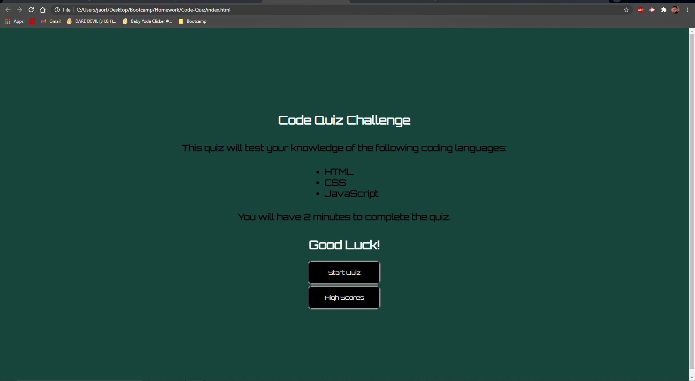

# 04 Web APIs: Code Quiz
[Launch Code Quiz](https://jaortisi6.github.io/Code-Quiz/)

# Screenshot

# Description

This quiz was created primarily using JavaScript and HTML and was styled using CSS. It will test your knowledge of all 3 languages using multiple choice questions!

# Assignment

As you proceed in your career as a web developer, you will probably be asked to complete a coding assessment, which is typically a combination of multiple-choice questions and interactive challenges. Build a timed code quiz with multiple-choice questions. This app will run in the browser and feature dynamically updated HTML and CSS powered by your JavaScript code. It will also feature a clean and polished user interface and be responsive, ensuring that it adapts to multiple screen sizes.